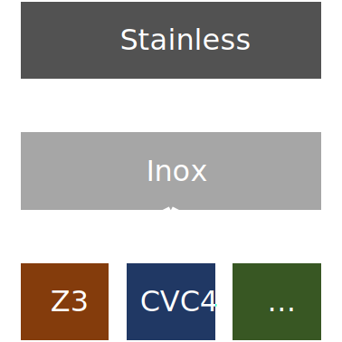

# Problem

```scala
def f(n: Int): Unit = {
  assert(n * n > 10)
}
```

# Problem

```
Found counter-example:
  n: Int -> -1743011841
```

# Problem

```scala
sealed abstract class Thing {
  def size: Int = this match {
    case Big(a, b, c) => a + b + c
    case Small() => 0
    case Medium(a) => a
  }
}
case class Big(a: Int, b: Int, c: Int) extends Thing
case class Small() extends Thing
case class Medium(a: Int) extends Thing

def g(t: Thing): Unit = {
  assert(t.size > 10)
}
```

# Problem

Solver can choose _any_ SAT assignment

Counter-examples could be arbitrarily large


# What we want

_Minimal_ counter-example

e.g. $x > 0 \rightarrow 1$, not $100$


# How?

"On SAT Modulo Theories and Optimization Problems"

_Robert Nieuwenhuis and Albert Oliveras, 2006_


# DPLL

- Solves _SAT_
- Formalized as a set of rules deriving a final _state_ $S$ from a start state $S_0$
- A state is either $FailState$ or $F \mathbin{||} M$
- $F$ is the formula to satisfy
- $M$ is a partial assignment of variables from $F$

# Derivation rules

$$\begin{array}{lll}
\textsf{UnitPropagate: } & & \\
M \mathbin{||} F, C \lor l &\Longrightarrow M \, l \mathbin{||} F, C \lor l &\textnormal{ if} \begin{cases}
M \models \lnot C \\
l \textnormal{ is undefined in } M.
\end{cases} \\
\textsf{Decide: } & & \\
M \mathbin{||} F &\Longrightarrow M \, l^d \mathbin{||} F &\textnormal{ if} \begin{cases}
l \textnormal{ or } \lnot l \textnormal{ occurs in a clause of } F \\
l \textnormal{ is undefined in } M.
\end{cases} \\
\textsf{Backtrack: } & & \\
M \, l^d \, N \mathbin{||} F, C &\Longrightarrow M \, \lnot l \mathbin{||} F, C &\textnormal{ if} \begin{cases}
M \, l^d \, N \models \lnot C \\
N \textnormal{ contains no decision literals}.
\end{cases} \\
\end{array}$$

# Example

Given

$$F = (\lnot x \lor y) \land (\lnot x \lor \lnot y) \land (\lnot x \lor y)$$

we have the following derivation:

$$\begin{array}{lrl}
&\emptyset&\Longrightarrow \textnormal{(Decide)} \\
&   x^d &\Longrightarrow \textnormal{(UnitPropagate)} \\
& \lnot y \; x^d &\Longrightarrow \textnormal{(Backtrack)} \\
 &  \lnot x &\Longrightarrow \textnormal{(UnitPropagate)} \\
 &  y \; \lnot x &\Longrightarrow \textnormal{(SUCCESS)} \\
\end{array}$$

# DPLL Modulo Theories

- Solves _SMT_
- Adapts DPLL to handle predicates from other theories

# Extra derivation rules

$$\begin{array}{lll}
\textsf{Theory Learn: } & & \\
T \mathbin{||} M \mathbin{||} F &\Longrightarrow T \mathbin{||} M \mathbin{||} F, C &\textnormal{ if} \begin{cases}
\textnormal{ each atom of } C \textnormal{ is in } F \textnormal{ or in } M \\
F \models_T C.
\end{cases} \\
\textsf{Theory forget: } & & \\
T \mathbin{||} M \mathbin{||} F, C &\Longrightarrow T \mathbin{||} M \mathbin{||} F &\textnormal{ if} \begin{cases}
F \models_T C.
\end{cases} \\
& & \\
\textsf{Theory Propagate: } & & \\
T \mathbin{||} M \mathbin{||} F &\Longrightarrow T \mathbin{||} M \, l' \mathbin{||} F &\textnormal{ if} \begin{cases}
M \models_T l \\
l' \textnormal{ or } \lnot l' \textnormal{ occurs in } F \\
l \textnormal{ is undefined in } M.
\end{cases} \\
\end{array}$$

# Strengthening DPLL Modulo Theories

- Can *strengthen* the theory at any point
- Allows to solve _optimization_ problems

# Extra derivation rule

$$\begin{array}{lll}
\textsf{Theory Strenghten: } & & \\
T \mathbin{||} M \mathbin{||} F &\Longrightarrow T \land T' \mathbin{||} M \mathbin{||} F & \\
\end{array}$$

# [Demo](https://github.com/mbovel/formal-verification-project/blob/main/paper-test-implementation/src/test/scala/DPLLTSTest.scala)

# Max-SMT

= Max + SMT

"Find an assignment that maximizes X satisfying F(X)"


# Weighted Max-SMT

List of (weight, constraint) tuples

Maximize sum of satisfied constraint weights

# What we use

Maximize / minimize operations

Already implemented in Z3


# Implementation



# Implementation

New solver type in Inox, Stainless's backend

No new code in Stainless needed

# [Demo](https://github.com/epfl-lara/inox/pull/171/files#diff-d6405538377e4b20686a09694f6ecd0957c72d54ba70fa5fb20694631e7b2ffcR107)

# Next steps

- Implementation in Stainless
- What is "Minimal" for multiple variables?
