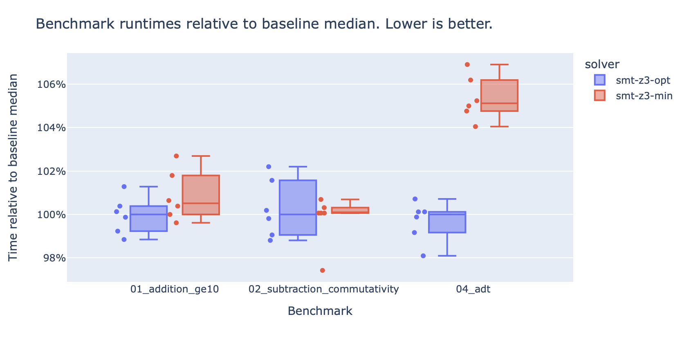

\Begin{abstract}

[Stainless](https://stainless.epfl.ch) is a tool for verifying
[Scala](https://www.scala-lang.org) programs. It can prove that some invariants
inside a function hold for all possible arguments, or show counter-examples when
they exist.

These synthesized counter-examples are unfortunately often suboptimal in terms
of human-readability. For example, when asked to provide two Java integers whose
sum is smaller than 10, Stainless outputs "2'146'959'355 and -2'146'959'347".
While correct, the answer "0 and 0" would probably look more intuitive to most
human brains.

We address this problem by extending
[Inox](https://github.com/epfl-lara/inox)---the engine behind Stainless---to
make it able to find models that are not only valid, but also minimal with
respect to some notion of size. To this end, we leverage the optimizing
capabilities of the [Z3](https://github.com/Z3Prover/z3) backend.

\End{abstract}

# Introduction

Many complementary techniques exist to make that programs work as expected.
Among which are _type systems_ that give guarantees about the possible set of
states in which a program can be. _Testing_ is also used to check that programs
are correct for _some inputs_. However, to make sure that a piece of code
behaves as expected _for all possible inputs_, one needs to go further.

One way is to write proofs manually or with the help of a proof assistant, but
this is time-consuming and requires a significant mathematical background.
Another solution is to automatically convert a program to a set of constraints
and use an _SMT solver_ to prove whereas these constraints are satisfiable or
not. Stainless is such a tool.

It allows developers to automatically verify functions written in a subset of
Scala by verifying the validity of _contracts_ embedded in the code, for example
in the form of pre- or post-conditions. In the following example, the function a
`intMinus` has a post-condition `.ensuring(_ == y - x)` aiming to check if Java
integers subtraction is commutative:

```scala
def intMinus(x: Int, y: Int) = {x - y}.ensuring(_ == y - x)
```

To verify this program, Stainless applies a succession of semantic-preserving
transformations until it fits into the pure higher-order functional language
fragment supported by Inox. Inox in turns transforms this fragment into
constraints to are fed to an SMT solver. Because the goal is to find a
counter-example to a property $p$, the SMT solver is queried for a model
satisfying $\lnot p$. The previous example is encoded as:

```plain
(declare-fun x () (_ BitVec 32))
(declare-fun y () (_ BitVec 32))
(assert (and
    (or
        (= (bvand x #b100...0) (bvand y #b100...0))
        (= (bvand x #b100...0) (bvand (bvsub x y) #b100...0))
    )
    (not (= (bvsub x y) (bvsub y x)))))
(check-sat)
```

This defines two vectors of 32 bits `x` and `y` and a constraint $\lnot ((x - y)
= (y - x))$ (right hand side of the logical `and`). The left hand side of the
`and` constraints the model further so that $x - y$ does not overflow, because
Stainless checks for overflows separately. It is of course possible to find such
a model, therefore Stainless outputs a counter-example:

```plain
Found counter-example:
    y: Int -> -107401216
    x: Int -> -270336
```

While this example indeed violates our post-condition as $-107401216 - -270336
\ne -270336 - -107401216$, it is needlessly verbose and unintuitive to human
eyes which would probably prefer something like $x = 0$ and $y = 1$. In other
words, we are interested not only in a valid counter-example, but we also aim
for a _minimal_ counter-example.

This is an _optimization_ problem which is stronger than the _satisfiability_
problems traditionally handled by SMT solvers. Nevertheless, it has been shown
in [@paper] that such solvers can be extended to efficiently deal with SMT
problems where models $M$ are sought such that a given cost function $f(M)$ is
minimized. We give a detailed summary of this paper in the annex background
report. We also provide a minimal example of the Optimizing DPLL modulo theories
written in Scala.

Z3---one of the SMT solvers that Inox can use---implements these optimization
capabilities for linear arithmetic objectives. For example, the following query
asks Z3 to optimize $x + y$ given the constraints $x \leq 2$ and $x - y \geq 1$.


```plain
(declare-fun x () Int)
(declare-fun y () Int)
(assert (<= x 2))
(assert (>= (- x y) 1))
(maximize (+ x y))
```

For this query, Z3 outputs the model $x = 2$ and $y = 1$, which is indeed
optimal with respect to the given constraints.

Our project consisted in making this optimization capabilities accessible from
Inox, and then using them to create a solver that automatically minimize the
_size_ of all free variables. In the following section, we detail how we
implemented this in Inox, how we defined sizing constraints for different
variable types. We then compare the new minimizing solver performance 
to the existing solvers in the Benchmarks section, before summarizing and
discussing possible enhancements and steps in the Conclusion. 

# Implementation

Inox already has the notion of a _solver_ interface that takes in constraints and outputs a satisfying assignment or UNSAT.
The existing solvers include Z3, CVC4, and Princess; furthermore, Z3 can be used either in "native" mode, talking to Z3
via its own API, or in "SMT-LIB" mode, talking to Z3 via standard SMT-LIB text queries.
The advantage of the SMT-LIB mode is that the same queries can be sent to any solver that supports SMT-LIB, modulo solver
specificities that should not exist in theory but happen in practice.

Inox already had a `Z3Optimizer` solver which supported a form of weighted Max-SMT: instead of merely asserting a constraint,
one could give the constraint a weight and the optimizer would try to maximize the sum of weights of satisfied constraints.
However, this does not work for our purposes, as we wish to maximize _variables_, not _constraint weights_.

We added support for maximization and minimization to Inox's internal _optimizer_ interface in pull request [#171](https://github.com/epfl-lara/inox/pull/171),
which was merged.

Using this support, we then added a `Z3Minimizer` solver in pull request [#176](https://github.com/epfl-lara/inox/pull/176),
which is currently open, that implements the minimization described in this report.
This solver can be used as `smt-z3-min`, for instance using Stainless's `--solvers=` argument.
It will automatically ask Z3 to minimize the variables in all queries, using the techniques we describe below.


## Numbers

Before discussing the minimization of numbers, we note that we use _integers_ to refer to the arithmetic integers,
which are unbounded and represented in Scala as `BigInt`s, not to Scala `Int`s and friends, which are _bit vectors_
of fixed size. This is important in the context of SMT, as the two cannot mix without explicit conversions, and
bit vectors are (on their own) decidable while integers are not always decidable (e.g., non-linear integer arithmetic is undecidable).

_Minimizing_ a number has an intuitive connotation of "making it smaller", but we must be more formal.
Asking Z3 to make an integer as small as possible is pointless, since integers are not bounded, and the result will
thus be some very large negative integer.
Instead, we minimize _the absolute value_, i.e., to minimize `x` we minimize `if (x >= 0) x else -x`.

The naïve approach of generating one big addition for all variables does not work because variables are of different sorts.
One cannot add bit vectors of different sizes together without an explicit conversion, which would require a first pass over
all variables to first check what the largest bit vector is.
Even if we extended the smaller bit vectors to make them all the same size, we would need to convert all bit vectors to integers
if any variable is an integer, an operation that Z3 supports but Inox currently does not expose (issue [#108](https://github.com/epfl-lara/inox/issues/108)).
Even if we added that support, the resulting query would be suboptimal since we would generate a large query with lots of explicit conversions
which would hinder performance (see Z3 issue [#1481](https://github.com/Z3Prover/z3/issues/1481)).

Instead, we generate one minimizing query per number.
We could in theory also generate minimization queries for other "primitive" types such as Booleans, but we did not see a need to do so.

In practice, for the given Scala code:
```scala
def add(x: Int, y: Int): Int = { x + y } ensuring(res => res >= 10)
```

An SMT-LIB query similar to this will be generated:
```lisp
...
(declare-fun x!110 () (_ BitVec 32))
(minimize (ite (bvsge x!110 0) x!110 (bvneg x!110)))
(declare-fun y!21 () (_ BitVec 32))
(minimize (ite (bvsge y!21 0) y!21 (bvneg y!21)))
...
```

The result will then be `0` and `0`, which are not just satisfactory assignments but also minimal.

## ADT

ADTs present two challenges for minimization: there is no formal notion of "minimum" for any ADT, and ADTs can be recursive.

One can design strategies for simple cases, such as preferring constructors with fewer parameters or constructors whose
parameters are themselves smaller, but the intersection of these goals has no obvious solution.
For instance, given an ADT with one constructor `A` taking one 64-bit vector and one constructor `B` taking two 16-bit vectors,
which constructor should be preferred for a counter-example?
We decided to prefer fewer parameters, and to give a "size" to each parameter types such that BVs are smaller than integers which are
themselves smaller than ADTs.

Here is a simple example of two non-recursive ADTs representing boxed
big integers and complex numbers:

```plain
final case class BoxedInt(value: BigInt)
sealed trait Comp
final case class BoxedComp(a: BoxedInt, b: BoxedInt) extends Comp
final case class UnboxedComp(a: BigInt, b: BigInt) extends Comp
```

Given `re` and `im` two accessors functions respectively returning the `BigInt`
value of the `a` and `b` field and the above definitions, we define a buggy
function `mult` multiplying two complex numbers in the following way and spot
the bug by checking that our operation in commutative:

```plain
def mult(a: Comp, b: Comp): Comp =
    UnboxedComp(re(a) * re(b) - im(a) * im(b),
                re(a) * im(b) + im(a) * re(a))
def multCommutative(a: Comp, b: Comp) =
    { mult(a, b) == mult(b, a) }.holds
```

With the default Z3 solver, Inox returns:

```plain
    a: Complex -> BoxedComplex(BoxedInt(BigInt("1")), BoxedInt(BigInt("0")))
    b: Complex -> BoxedComplex(BoxedInt(BigInt("0")), BoxedInt(BigInt("1")))
```

For the variable `a`, our solver adds the following constraints: [TODO: simplify]

```plain
(minimize (ite ((_ is UnboxedComplex!2) b!21) #b0000000000000000000000000000000000000000000000000000000000001010 #b0000000000000000000000000000000000000000000000000000000000010100))
(minimize (ite ((_ is UnboxedComplex!2) b!21) (ite (>= (x!127 b!21) 0) (x!127 b!21) (- (x!127 b!21))) 0))
(minimize (ite ((_ is UnboxedComplex!2) b!21) (ite (>= (y!32 b!21) 0) (y!32 b!21) (- (y!32 b!21))) 0))
```

Which allow to return a smaller counter example:

```plain
    a: Complex -> UnboxedComplex(BigInt("0"), BigInt("0"))
    b: Complex -> UnboxedComplex(BigInt("-1"), BigInt("-1"))
```

## Recursion

Inox supports recursive functions and ADTs by _unrolling_ them and querying the
SMT solver incrementally for increasing depths.

For example, one can define a recursive `MyList` ADT and recursive a recursive
function `myMin` as follows in the
[SMT2](https://smtlib.cs.uiowa.edu/language.shtml) or
[TIP](https://tip-org.github.io)^[TIP is a superset of SMT2. This example does
not use any extra feature from TIP and can therefore be run both by Inox (`inox
--solvers=smt-z3-min example.tip`) and by Z3 (`z3 example.tip`). Note that Inox
automatically outputs a model, while Z3 needs an explicit `(get-model)` commands
to do so. ] format:

```plain
(declare-datatypes () (
    (MyList
        (MyNil)
        (MyCons (x Int) (xs MyList)))))
(define-fun-rec myMin ((t MyList)) Int
    (match t 
        (case MyNil 1000)
        (case (MyCons x xs)
            (let ((xsMin (myMin xs)))
            (ite (<= x xsMin) x xsMin)))))
```

Given a `myMax` function defined in the same way as `myMin` (see appendix for full
example snippets), we can query for a list where the minimum and the maximum are
different using:

```plain
(declare-fun aList () MyList)
(assert (>= (myMin aList) 0))
(assert (<= (myMin aList) 999))
(assert (not (= (myMin aList) (myMax aList))))
```

In such a case, Inox will first try to find a model where `aList` is `MyNil`,
then instantiate the recursive function once and try models where `aList` has
length 1 and so on. In this case, in will stop at length 2 and output
`MyCons(39, MyCons(38, MyNil()))` with the default Z3 solver, and `MyCons(0,
MyCons(1, MyNil()))` with the new minimizing solver.

Note that in general, this will minimize the depth of the unrolling and not the
size of the argument. A general procedure for optimizing the argument would not
be decidable as the number of such possible models is unbounded.

# Benchmarks

[Quick benchmarks and a nice boxplot with our examples comparing run times between
(--solvers=smt-z3-min and --solvers=smt-z3-opt)].



[TODO mention that there's no overhead for UNSAT VCs, which is the happy case when the code under verif is correct]

[TODO add a sentence to the conclusion with a summary of the perf]

# Conclusion

In summary, we have successfully implemented a prototype of minimization in Inox, and are on the way to getting it merged to mainline so that
any user of Inox or Stainless can use it by changing command-line arguments.

We encountered two key problems, one at the design level and one at the implementation level.
At the design level, the notion of "minimization" is not as well-defined as one would think in the context of real code: one has to make choices
as to what to favor, such as fewer fields vs. smaller types in bits.
At the implementation level, one cannot create a giant "sum of all variables" expressions as the variables may be of different kinds, and the types
may be recursively defined, requiring the solver to stop at some point that must be explicitly chosen.

The next step is for our pull request to be merged, and then perhaps improved to support more scenarios or more complex minimization policies;
this is no longer a pure formal methods problem but also enters human-computer interactions territory as to what users of verification tools prefer.
For instance, at what point does an integer become "bigger" than an ADT? Is it better to have two 15-bit values or one 32-bit value?

Our code is in the pull requests [#171](https://github.com/epfl-lara/inox/pull/171) (merged) and [#176](https://github.com/epfl-lara/inox/pull/176) (open) for Inox.
We also have a toy implementation of DPLL in Scala at <https://github.com/mbovel/formal-verification-project/tree/main/paper-test-implementation>.